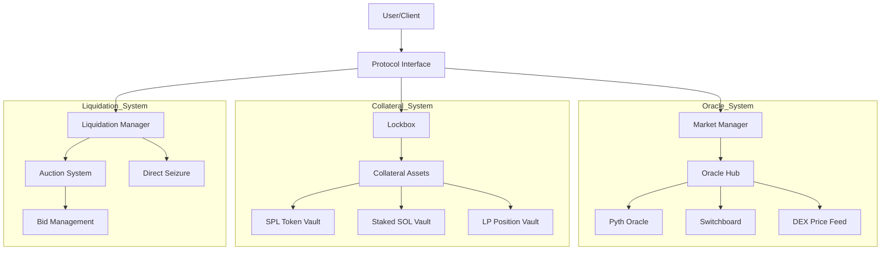
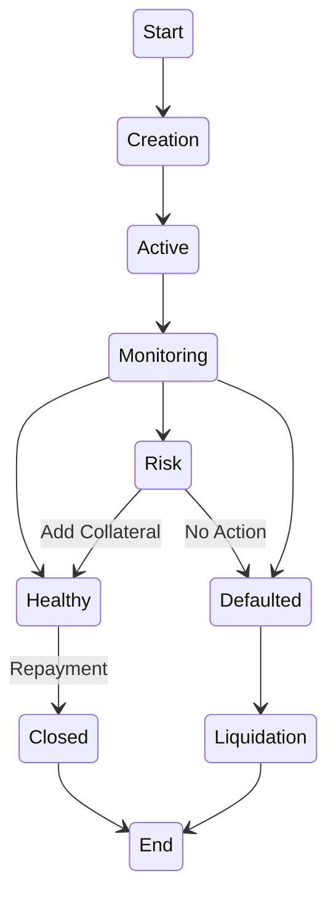
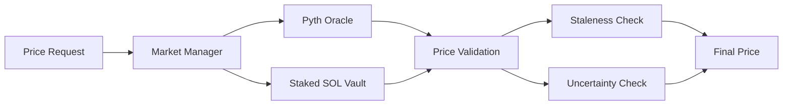
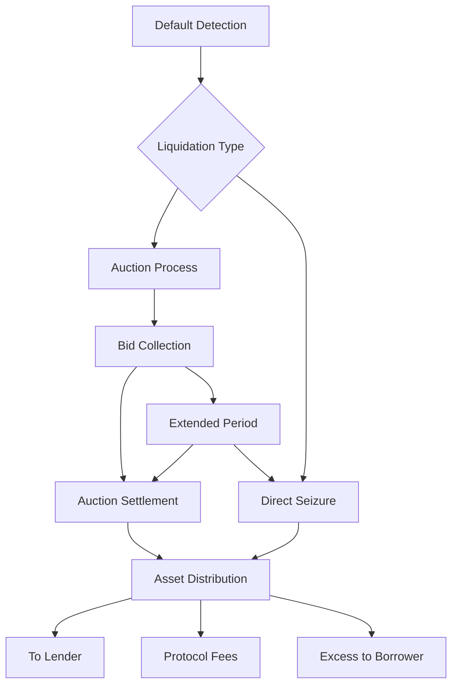

# Loopscale Program Audit Report

<div align="center">

</div>

**Authors:**  
David P – david@fomo3d.app david@madshield.xyz  
BlueWolf – wolf@madshield.xyz<br>
JecikPo - je@madshield.xyz
## Table of Contents
1. [Introduction](#1-introduction)
2. [Findings & Recommendations](#2-findings--recommendations)
   - [2.1 Findings Summary](#21-findings-summary)
   - [2.2 Findings Description](#22-findings-description)
3. [Protocol Overview](#3-protocol-overview)
   - [3.1 Program Charts](#31-program-charts)
4. [Methodology](#4-methodology)
5. [Scope and Objectives](#5-scope-and-objectives)
6. [Conclusion](#6-conclusion)

## 1. Introduction
This audit focuses on the Loopscale protocol, a Solana-based lending platform designed to revolutionize asset-backed financing through an innovative creditbook system. Loopscale addresses the challenges of traditional DeFi lending by implementing a sophisticated order-book based lending mechanism with support for complex collateral types including staked SOL, LP tokens, and external yield-generating positions.
The audit was conducted between the 16th of January 2025 and the 24th of February.
This report outlines the audit process, describes the methodology used, and examines the protocol's security. Special attention is given to:
- Complex collateral management systems
- External protocol integrations (Orca, Meteora)
- Multi-token standard support (SPL Token and Token-2022)
- Yield-generating strategy implementations
 The protocol's architecture demonstrates a focus on security and scalability, with particular emphasis on safe handling of complex financial operations and external protocol integrations.


## 2. Findings & Recommendations
Our severity classification system adheres to the criteria outlined here.

| Severity Level | Exploitability | Potential Impact | Examples |
|----------------|----------------|------------------|-----------|
| 🔴 Critical | Low to moderate difficulty, 3rd-party attacker | Irreparable financial harm | Direct theft of funds, permanent freezing of tokens/NFTs |
| 🔶 High | High difficulty, external attacker or specific user interactions | Recoverable financial harm | Temporary freezing of assets |
| 🟡 Medium | Unexpected behavior, potential for misuse | Limited to no financial harm, non-critical disruption | Escalation of non-sensitive privilege, program malfunctions |
| 🔵 Low | Implementation variance, uncommon scenarios | Zero financial implications, minor inconvenience | Program crashes in rare situations |
| ℹ️ Informational | N/A | Recommendations for improvement | Design enhancements, best practices |

### 2.1. Findings Summary

| Finding | Description | Severity Level |
|---------|-------------|----------------|
| [LOOPSCALE_01]| Lack of Weight Matrix Validation could lead to Same Collateral Backing More Than 1 Loan | 🔴 Critical |
| [LOOPSCALE_02]| Permanent Token Lock via Unhandled StakedSol Asset Type in Withdrawal Function| 🔴 Critical |
| [LOOPSCALE_03]| Lack of Oracle Account Validation Leads to Stolen Funds| 🔴 Critical |
| [LOOPSCALE_04]| Lack of Collateral Identifier Validation Could Lead to Lower Loan APY Selection| 🔶 High |
| [LOOPSCALE_05]| Incorrect Principal Valuation Rounding by Uncertainty Parameter| 🟡 Medium |
| [LOOPSCALE_I1]| Debugging Outputs Not Cleaned Up| ℹ️ Informational |
| [LOOPSCALE_I2]| Lack of Support for All Oracle Choices | ℹ️ Informational |

### 2.2. Findings Description

#### LOOPSCALE_01 Lack of Weight Matrix Validation could lead to Same Collateral Backing More Than 1 Loan [Critical]

Parameters of the Repayment instructions contains (among others) the `weight_matrix` arrays which specifies for which ledger's loan the collateral is backing up and up to which percentage. The percentage sum for all ledgers backed by the collateral must not be greater than 100%. While it is up to the user to provide the `weight_matrix` it needs to be validated if the above condition holds true. This is achieved by the `is_valid_weight_matrix()` method, which is applied on the `loan`, e.g. on the Deposit Collateral instruction:
```rust
    #[account(
        mut,
        has_one = borrower,
        constraint = is_valid_weight_matrix(&params.weight_matrix),
    )]
    pub loan: AccountLoader<'info, Loan>,
```
This validation is not applied on the Repay instruction context definition (repay.rs):
```rust
    #[account(
        mut,
        has_one = borrower,
    )]
    pub loan: AccountLoader<'info, Loan>,
```
We can see later on that the `weight_matrix` is applied in the handler:
```rust
    loan.write_weight_matrix(params.weight_matrix);
```
As a result the user could provide a malicious `weight_matrix` with sum of collateral weights spread across ledgers greater than 100%. This will allow undercollateralization of the loan as the same collateral amount could be used to back up different ledgers.

This issue has been fixed.

---

#### LOOPSCALE_02 - Permanent Token Lock via unhandled StakedSol Asset Type in Withdrawal Function [Critical]

A vulnerability exists in the protocol where users could permanently lock their StakedSol tokens by depositing them as collateral, as the withdrawal function lacks handling for this asset type.

`bridgesplit-program-library/loopscale-program-utils/src/constants.rs` (lines 39-45)
```rust
pub enum AssetType {
    #[default]
    Spl,
    StakedSol,
    Orca,
}
```
 `bridgesplit-program-library/programs/loopscale/src/state/creditbook/loan.rs` (lines ~330-350)
```rust
match AssetType::from_primitive(self.collateral[collateral_index].asset_type) {
    AssetType::Spl => {
        let amount: u64 = self.collateral[collateral_index].amount.into();
        self.collateral[collateral_index].amount = amount.checked_sub(params.amount).ok_or(LoopscaleErrorCodes::ArithmeticOverflow)?.into();
        if self.collateral[collateral_index].amount == 0.into() {
            self.collateral[collateral_index] = CollateralData::default();
        }
    },
    AssetType::Orca => {
        if amount != 1 {
            return Err(LoopscaleErrorCodes::PartialWithdrawsNotAllowedForOrcaPositions.into());
        }
        self.collateral[collateral_index] = CollateralData::default();
    },
    _ => return Err(LoopscaleErrorCodes::InvalidCollateralMint.into()),
}
```
The `AssetType` enum includes StakedSol as a valid variant and the `withdraw_collateral` function only handles Spl and Orca asset types.
Any attempt to withdraw StakedSol collateral falls into the catch-all case `(_)`, resulting in an `InvalidCollateralMint` error.
There are no guards in the deposit flow preventing users from depositing StakedSol tokens, thus creating a situation where users can deposit StakedSol but can never withdraw them.

After discussion with the development team, the StakedSol variant will be removed from the AssetType enum before the contracts go live. The team plans to reintroduce staked SOL support in a future v2 release, where it will be implemented with proper deposit and withdrawal functionality. This approach eliminates the risk of users accidentally depositing staked SOL tokens that would become permanently locked in the protocol.

---

#### LOOPSCALE_03 - Lack of Oracle Account Validation Leads to Stolen Funds [Critical]

The protocol's asset pricing mechanism through querying oracles lacks proper validation of the `oracle_account` which is just taken from the `remaining accounts`:

`bridgesplit-program-library/programs/loopscale/src/state/oracle.rs`
```rust
let oracle_account = remaining_accounts.next()?;
```
This insufficient validation allows a malicious user to provide a `oracle_account` that does not exists in `strategy.collateral_map` hence it could be an account containing a malicious pricing information.

This issue has been fixed by adding proper validation in `get_price()` against the correct oracle account stored `market_information`.

---

#### LOOPSCALE_04 - Lack of Collateral Identifier Validation Could Lead to Lower Loan APY Selection [High]

A vulnerability exists in the protocol where users can manipulate loan APY rates by specifying a lower-risk asset identifier while depositing a higher-risk asset as collateral, due to missing validation between `asset_mint` and `asset_identifier`.
`bridgesplit-program-library/programs/loopscale/src/state/creditbook/loan.rs` (lines 156-192)
```rust
if let Some(i) = index {
    collateral_index = Some(i);
    self.collateral[i].asset_mint = asset_mint;
    self.collateral[i].amount = amount.into();
    self.collateral[i].asset_type = asset_type;
    self.collateral[i].asset_identifier = asset_identifier; // No validation between mint and identifier
}
```
`bridgesplit-program-library/programs/loopscale/src/utils/strategy/admin.rs` (lines 4-29)
```rust
pub fn get_max_apy_for_collateral<'info>(
    &self,
    collateral_asset_identifiers: &[Pubkey],
    market_information: AccountLoader<'info, MarketInformation>,
    duration_index: DurationIndex,
) -> Result<u64> {
    let mut apy = 0;
    let mut has_supported_collateral = false;

    for mint in collateral_asset_identifiers {
        if let Some(index) = market_information.load()?.find_asset_index(*mint) {
            let current_collateral_apy = u64::from(self.collateral_map[index as usize][duration_index as usize]);
            if current_collateral_apy != DISABLED_APY {
                apy = std::cmp::max(apy, current_collateral_apy);
                has_supported_collateral = true;
            }
        }
    }
    // ...
}
```
The vulnerability arises because the `add_collateral` function accepts both `asset_mint` and `asset_identifier` parameters but never validates their correspondence. The APY calculation in `get_max_apy_for_collateral` then uses these potentially mismatched identifiers to determine interest rates.
This mismatch allows borrowers to circumvent the protocol's risk-based pricing mechanism, potentially leading to:
- Incorrect interest rate charges
- Inaccurate risk assessment
- Protocol revenue loss
- Risk of undercollateralization due to mismatched risk parameters

A fix for this issue has been implemented. Using a function called verify_collateral_data that is called on create and deposit

---

#### LOOPSCALE_05 - Incorrect Principal Valuation Rounding by Uncertainty Parameter [Medium]

A vulnerability exists in the protocol where principal (debt) values are incorrectly calculated using `UncertaintyBias::Subtract` instead of `UncertaintyBias::Add`, leading to potential undervaluation of loan principals.
`bridgesplit-program-library/programs/loopscale/src/state/creditbook/loan.rs`
```rust
let principal_price = market_info.load()?.get_price(
    asset_index_guidance.pop_front().ok_or(LoopscaleErrorCodes::InvalidAssetIndexGuidance)?,
    self.principal_mint,
    self.principal_mint,
    &remaining_accounts,
    total_payoff_amount,
    current_timestamp,
    UncertaintyBias::Subtract,  // HERE
    price_type,
)?[0];
```
The vulnerability arises because when calculating loan values using Pyth oracle prices, the system must handle price uncertainty confidence intervals correctly:
- For principal (debt) calculations: Should use UncertaintyBias::Add to get maximum possible value
- For collateral calculations: Should use UncertaintyBias::Subtract to get minimum possible value (this is correct in the code)

After discussion with the development team, the `UncertaintyBias` parameter was changed to `Add` for principal price calculations while keeping `Subtract` for collateral valuations.

---

#### LOOPSCALE_I1 - Debugging Outputs Not Cleaned Up [Informational]

The codebase contains numerous debug print statements (`msg!` and `println!`) that were likely used during development but remain in the production code. 
Multiple files contain debug print statements, including:
- `strategy/ledger.rs`: Prints ledger state variables
- `strategy/nav.rs`: Prints NAV calculations
- `oracle/meteora/dynamic_pools.rs`: Prints token prices
- `creditbook/loan.rs`: Prints loan state changes
- `instructions/strategy/update.rs`: Prints strategy update steps

The recommended fix is to remove all debug print statements from production code or replace necessary logging with proper event emissions.

---

#### LOOPSCALE_I2 - Lack of Support for All Oracle Choices [Informational]

The protocol's oracle implementation (`OracleType` enum) includes several oracle types, but the price fetching logic doesn't fully support all of them, potentially limiting the protocol's functionality.

The `OracleType` enum in the codebase defines multiple oracle types:
```rust
pub enum OracleType {
    PythLegacy,      //0
    StakePoolLST,    //1
    MeteoraLP,       //2
    MeteoraVault,    //3
    SwitchboardPull, //4
    OrcaWhirlpool,   //5
    Pyth,            //6
    Flp,             //7
    LoopscaleVaultLp //8
}
```
However, in the `get_price` implementation, some oracle types are not fully supported or fall through to the default error case:
```rust
match OracleType::from(asset_data.oracle_type) {
    OracleType::StakePoolLST => { ... }
    OracleType::MeteoraLP => { ... }
    OracleType::MeteoraVault => { ... }
    OracleType::OrcaWhirlpool => { ... }
    OracleType::Pyth => { ... }
    OracleType::Flp => { ... }
    OracleType::LoopscaleVaultLp => { ... }
    _ => Err(LoopscaleErrorCodes::InvalidConversionOracleQuote.into()),
}
```
The recommended fix is to remove unused oracle types from the enum if they're not planned to be supported.

---

## 3. Protocol Overview
Loopscale emerges as a groundbreaking lending protocol in the Solana ecosystem, introducing a comprehensive lending infrastructure that prioritizes security and flexibility. At its core, the protocol leverages a sophisticated market manager system that integrates multiple price oracles, including Pyth and Switchboard, ensuring reliable price feeds and risk assessment. This multi-oracle approach provides robust price validation and risk management, crucial for maintaining the protocol's stability.

The protocol's architecture centers around a secure lockbox system for collateral custody, complemented by an efficient liquidation framework that protects both lenders and borrowers. Through its innovative design, Loopscale supports a wide range of assets, including traditional SPL tokens, Token-2022 standards, staked SOL, and various DEX LP positions, making it one of the most versatile lending protocols on Solana. The liquidation system employs both auction-based mechanisms and direct seizure options, providing flexibility in handling defaulted positions while maintaining market stability.

Loopscale's economic model introduces sophisticated fee structures and yield-generating opportunities, carefully balanced with risk management mechanisms. The protocol employs protected arithmetic calculations throughout its operations, ensuring mathematical safety in all transactions. This attention to security extends to its multi-oracle integration, which includes comprehensive staleness checks and uncertainty thresholds, making it particularly resilient against market volatility and manipulation attempts.

Built on Solana's high-performance infrastructure, Loopscale maintains comprehensive error handling and event emission systems, enabling transparent tracking of all protocol activities. This robust technical foundation, combined with its innovative features and security measures, positions Loopscale as a cornerstone lending protocol in the Solana DeFi ecosystem, capable of serving diverse lending needs while maintaining the highest standards of security and efficiency.

### 3.1 Program Charts

#### Protocol Architecture Flow



The Protocol Architecture diagram illustrates how users interact with Loopscale through its interface layer, which coordinates with three core components. The Market Manager aggregates multiple oracle sources for reliable pricing, the Lockbox secures various types of collateral, and the Liquidation Manager handles defaulted positions through auctions or direct seizure.

#### Lending Position Lifecycle

The Lending Position Lifecycle shows how a position evolves from creation through various states. It demonstrates the continuous monitoring process and possible outcomes, including healthy repayment or liquidation, with clear decision points based on position health.

#### Oracle Integration Flow


The Oracle Integration Flow demonstrates how Loopscale aggregates and validates prices from multiple sources. It shows the validation process including staleness and uncertainty checks, with fallback mechanisms to ensure reliable pricing data.

#### Liquidation Process Flow


The Liquidation Process Flow maps out how defaulted positions are handled. It shows the two main liquidation paths - auction-based and direct seizure - and details the complete process from default trigger through asset distribution, including handling of edge cases like failed auctions.

## 4. Methodology
Given that Loopscale is a lending protocol managing complex collateral positions and oracle integrations, we employed a comprehensive and systematic methodology to test the protocol's risk management and liquidation mechanisms. Our primary approach involved analyzing the multi-oracle price feed system and position management mechanisms to validate the protocol's security and reliability.

This methodology allowed us to observe how the protocol would operate in real-world market conditions, especially focusing on the price feed validation implementation and liquidation trigger systems. This security-focused approach was essential for evaluating the safety and reliability of the protocol's core components, particularly the oracle integration and collateral management.

We conducted detailed code analysis of price feed aggregation and liquidation processing functions. This included reviewing the implementation of oracle data validation , position health monitoring, and the security of liquidation processing, across different market scenarios.
We documented security observations and potential improvements to enhance the protocol's reliability and safety, ensuring robust operation in volatile market conditions. Particular emphasis was placed on the protocol's claims of secure collateral management through the Lockbox system and efficient liquidation mechanisms through proper price feed validation and auction management.


## 5. Scope and Objectives

The primary objectives of the audit are defined as:

- Minimizing the possible presence of any critical vulnerabilities in the program. This would include detailed examination of the code and edge case scrutinization to find as many vulnerabilities. 


- 2-way communication during the audit process. This included for OShield to reach a perfect understanding of the design of the system and the goals of the team.

- Provide clear and thorough explanations of all vulnerabilities discovered during the process with potential suggestions and recommendations for fixes and code improvements. 

- Clear attention to the documentation of the vulnerabilities with an eventual publication of a comprehensive audit report to the public audience for all stakeholders to understand the security status of the programs. 

### Repository Information

| Item | Details |
|------|---------|
| Repository URL | https://github.com/bridgesplit/bridgesplit-program-library |
| Commit (start of audit) | e5a73897c363d3a1a55113de6abdec5784931f01 |
| Commit (end of audit) | TBD |

## 6. Conclusion
OShield conducted an extensive audit of Loopscale, utilizing a hands-on methodology that prioritizes a detailed, immersive review of the program. Our team's approach is rooted in active collaboration, working closely with each unique project to identify potential security risks and mitigate vulnerabilities effectively.
OShield's dedication to advancing auditing techniques is clear throughout our process. We consistently apply innovative strategies, allowing us to analyze the code at a granular level, simulate real-world scenarios, and uncover potential risks that traditional audits might miss.

Oshield identified three critical-severity, 1 high-severity, 1 medium-severity, and two informational issues. Through active collaboration with the development team, all critical, high-risk and medium-risk issues were resolved. The development team's responsive approach to addressing findings and commitment to implementing recommended fixes indicates a strong security-first mindset.
Our recommendations focus on strengthening the codebase to enhance long-term security and resilience. OShield remains committed to setting new standards in smart contract auditing.
